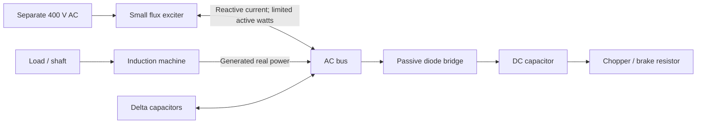

# Reviewed external-exciter topology

The default UI now represents a small externally supplied flux exciter and a
separate passive regeneration path. It is not the previous DC-fed regenerative
VFD model. Earlier modes are retained as **legacy comparisons**, with their
original assumptions; new core-loss and external-startup parameters apply to
the reviewed model only.



## Physics and explicit assumptions

**Machine.** Balanced stationary alpha-beta peak vectors, referred rotor and
star-equivalent per-phase parameters. `P = 1.5 Re(v conj(i))` and
`Q = 1.5 Im(v conj(i))`; line RMS voltage is `sqrt(3/2) abs(v)`.
The existing nonlinear magnetization law is retained:

```text
psi_s = L_ls i_s + psi_m
psi_r = L_lr i_r + psi_m
i_m = psi_m/L_m * (1 + |psi_m|²/psi_sat²)
dpsi_s/dt = v - R_s i_s
dpsi_r/dt = -R_r i_r + j pole_pairs omega psi_r
T_e = 1.5 pole_pairs Im(conj(psi_s) i_s)
```

Torque is positive in the lowering direction. Terminal active export includes
core loss, so negative torque does not by itself guarantee terminal generation.
The conventional flux/current and mechanical-loss formulation is consistent
with the [MathWorks induction-machine equations](https://www.mathworks.com/help/mcb/ref/inductionmotor.html),
accounting for the different vector normalization used here.

**Core loss.** A terminal-referred shunt `R_core` draws `i_core=v/R_core` and
dissipates `P_core=1.5 |v|²/R_core = V_LL²/R_core`. It loads the actual AC
capacitor/voltage dynamics and changes electrical demand and voltage buildup;
it is not merely subtracted from a displayed efficiency. The default 4,000
ohm/phase corresponds to 40 W at 400 V. This is the simplified input-shunt
iron-loss branch shown in the [TU Darmstadt electrical-machines notes](https://www.etit.tu-darmstadt.de/media/ew/rd/ew_vorlesungen/lv_cad/CAD_Skript_WS23_24.pdf).
It approximates air-gap iron losses by terminal voltage, with no separate
hysteresis/eddy frequency law, thermal dependence, or rotor iron loss.
Critical capacitance/low-frequency startup predictions therefore remain
qualitative until measured no-load/loss data are fitted.

**Small exciter.** The input is a stiff, separate external AC supply. Exciter ON
represents both supply availability and enable; the generated DC link cannot
power this exciter. A rotating flux reference generates voltage feedforward
and flux-error feedback. The requested capacitor-voltage derivative determines
the needed current after accounting for the machine, core, and passive bridge.
The AC voltage remains a dynamic state, not an ideal imposed V/f source.

The converter current request is projected onto:

- a 3 A RMS default current circle;
- an internal-voltage circle limited to the external supply's phase peak,
  behind the estimated output resistance;
- a 200 W default positive active-output limit;
- a negative active-power allowance of at most 5 W **and** at most 2% of
  contemporaneous positive machine export.

The small negative allowance is dissipated locally; it cannot flow back to the
external supply. This is an explicit averaged **reverse-blocking converter with
a small local dissipative path**, not the uncontrolled antiparallel-diode
behavior of an ordinary VFD. Actual hardware must provide this behavior.
Above its feasible AC voltage/current envelope the model blocks output.
It does not simulate the exciter's private DC capacitor, PWM, commutation,
switching delays, or local overvoltage protection. The 2% limit is a deliberate
architecture/control assumption, not a general property of induction machines.

```text
P_AC = 1.5 Re(v conj(i_exciter))        [positive: exciter -> bus]
P_conduction = 1.5 R_out |i_exciter|² + P_idle
P_external = max(P_AC, 0) + P_conduction
P_converter_loss = P_conduction + max(-P_AC, 0)
P_external = P_AC + P_converter_loss
```

Consequently active excitation can charge the main DC capacitor through the
passive bridge, particularly during startup. Sources mix at the AC bus; the
model does not artificially label those watts as gravity. It cannot, however,
route the generated load power backwards through the small exciter. Setting
the small absorption allowance to zero is optional, not the imposed default.

**Passive rectifier.** For sinusoidal balanced line voltage, let
`Vpk=sqrt(2) V_LL` and integrate over each 60-degree rectified crest:

```text
i(theta) = max((Vpk cos(theta) - Vdc)/R_source, 0)
theta in [-pi/6, pi/6]
I_dc = (3/pi) integral i(theta) dtheta
P_AC = (3/pi) integral Vpk cos(theta) i(theta) dtheta
P_DC = Vdc I_dc
P_bridge_loss = P_AC - P_DC
```

The closed-form partial-conduction integral is implemented in
`capacitor_rectifier.py`. At no load a capacitor can approach `sqrt(2) V_LL`;
`1.35 V_LL` is the full-crest average, not a universal capacitor charging
ceiling. At 400 V LL the reviewed bridge can still conduct at 550 V DC,
where the old 1.35 multiplier model blocked. Independent numerical quadrature
tests check both current and power through full/partial/blocking conditions.

AC voltage amplitude and DC voltage are treated as locally constant over the
crest average. The AC-side equivalent current carries the computed active
power at the fundamental. Source resistance accounts for charging loss;
source inductance, harmonic RMS heating, diode drops, commutation overlap,
six-pulse ripple, and individual switching are omitted. This balanced averaged
approximation is least accurate in the first cycles at very low frequency;
it must not be used for diode peak-current or inrush sizing.

**Mechanical losses.** The rigid single-DOF model remains:

```text
J_eff = J_shaft + m r_eff²
T_gear_loss = (1 - eta_gear) m g r_eff
T_bearing = configured constant opposing Coulomb torque
T_viscous = b omega
```

Gear loss is a gravity-referred lowering efficiency, not a bidirectional
gearbox model. Bearings/seals use constant opposing torque, including the
existing stop/stiction rule. Default efficiency is 0.90 and bearing/seal
torque 0.10 Nm; the existing 0.001 Nm s/rad viscous term remains separate.
Gear, bearing, mechanical brake, viscous, and landing energies are separately
tracked; the overview combines viscous and landing in one inventory row.
`effective_radius()` marks the future radius-law interface. The current
constant radius is the drum radius divided by gear ratio; a variable-radius
extension must also change reflected inertia and kinematics consistently.
No rope elasticity, structural motion, impact-force or peak rope-force
prediction has been added.

## Startup and estimated example

The reviewed example keeps the earlier estimated 0.9 kW, four-pole motor,
300 kg load, 200 m height, 0.1 m drum / 60:1 ratio, and 6 microfarad delta
capacitors. All component values remain estimates, not an identified motor.
The chopper threshold is 500 V with a 40 V proportional band and 20 ms duty
response; the resistor is 330 ohm. These estimates keep the normal bus within
the external exciter's voltage envelope. No closed-loop load-speed regulator
or resistor thermal model is implied by DC-voltage control.

The initial shaft speed, magnetic seed, and AC/DC precharge are all zero.
The exciter first builds flux at 2 Hz with the mechanical brake held. Flux
must stay above 80% of the 0.95 Wb-turn target for 0.2 s; then the brake command
releases and frequency ramps to 50 Hz in 0.3 s. With supply unavailable the
sequencer waits with the brake held. After release, loss of excitation does
not automatically reapply the brake: this is an excitation/startup experiment,
not a safety supervisor. The manual brake checkbox overrides sequencing;
Reset restores it. Explicit initial speed/precharge can still be entered.

For the reviewed estimates the brake release command occurs at about 0.320 s.
By 3 s the load approaches steady descent:

| Quantity | Result |
|---|---:|
| Descent | 16.228 m/min |
| Shaft | 1,549.68 RPM |
| AC line RMS / DC link | 389.46 V / 525.13 V |
| Gravity power | 795.99 W |
| Machine shaft input | 673.83 W |
| Machine terminal export | 550.42 W |
| Exciter AC active / reactive | -5.00 W / +161.15 var |
| External supply input | 3.86 W |
| Passive bridge AC input | 545.42 W |
| DC input / brake heat | 524.91 W / 524.92 W |
| Copper / core losses | 85.49 W / 37.92 W |
| Gear / bearings / viscous | 79.60 W / 16.23 W / 26.34 W |
| Bridge / converter loss | 20.51 W / 8.86 W |

Approximately 99.1% of terminal generation goes into the passive bridge.
The external supply remains a net source. The -5 W at the exciter AC terminal
is its small local dissipative allowance, already included in converter heat.
This demonstrates bootstrap for these model assumptions; it is not proof of
startup capability for unspecified hardware or arbitrary parameter choices.

## Numerical changes and energy balance

The new primary DC state is `E_dc` in joules, initially `0.5 C V_initial²`.
Voltage is recovered as `sqrt(2 E_dc/C)`; invalid negative energy raises an
error. A positive midpoint voltage predictor solves the capacitor charge
equation with the averaged bridge and chopper conductance. The accepted energy
increment uses the actual RK-stage mean bridge DC power minus chopper heat.
It therefore accounts for charging from exactly zero, rather than becoming
stuck at `dE/dt=V I=0` at zero voltage.

Negative-energy trials are rejected and subdivided **before state mutation**;
there is no post-integration voltage/energy clamp. Positive DC voltage is also
enforced in legacy comparison modes by rejecting negative RK stages and
subdividing their original voltage integration. Only the reviewed default
uses the new energy-state formulation and capacitor-input bridge.

Full flux/AC dynamics use RK4 and cached electrical constants. Inner loops use
torque/current derivatives and compact tuples, not output telemetry. Mechanical
midpoint prediction restores four scalar state fields, avoiding per-substep
dataclass copies. RK-stage average torque advances mechanics. Electrical steps
are bounded by winding, rotation, LC, rectifier, core, and control timescales.
The DC midpoint treatment and mechanical coupling make the overall scheme
second order in general, despite the RK4 electrical stages. Contact is split
in both the mechanical and electrical work integration.

All dissipative/source integrals use the same stage powers as the states:

```text
residual = (K + W_field + E_AC + E_DC - m g x) - initial_energy
         + E_copper + E_core + E_gear + E_bearings + E_mechanical_brake
         + E_viscous + E_landing + E_bridge_loss + E_converter_loss
         + E_DC_brake - E_external

E_DC - E_DC_initial = E_bridge_DC - E_DC_brake
E_bridge_AC = E_bridge_DC + E_bridge_loss
```

Bridge transfer is reported cumulatively but is an **internal transfer**, not
an extra final energy sink. The overview inventory includes the original
height energy, explicit initial stored energy, and external input. It does
not normalize all losses to pretend they came exclusively from gravity.

## Validation, performance, and changed files

Run `python -m unittest discover -s simulation/tests -v` for the complete suite,
and `python -m simulation.review_report` for repeatable numeric results in
[review-results.json](review-results.json). The final suite includes 83 tests:
the prior 70 plus 13 reviewed-topology tests, with additional parameterized
slip, voltage, load, bridge, and depletion cases. GUI review checks both tabs,
startup/control behavior, legacy comparisons, and accessible scroll bounds
at 1280x850, 1000x700, and 720x480.

The reference is an independently solved conventional nonlinear T circuit:
`R_s+j w L_ls` feeding magnetizing `j w L_m_eff` in parallel with
`R_r/slip+j w L_lr`, plus the approximate terminal iron-loss shunt.
It uses RMS phasor algebra and a separate inductance bisection; it does not
call the dynamic current inversion. Eight points span slips -0.30 through
1.0 and 100–400 V, covering generation, synchronous operation, motoring, and
locked rotor. The dynamic machine is driven by prescribed sinusoidal voltage
and allowed to settle for two seconds. Maximum observed absolute errors were
0.000018 Nm, 0.0000011 A, 0.000071 W, and 0.000231 var. These are equation/
normalization checks, not comparisons against a measured motor.

Other checks cover 200/300/400 kg loads, nonregenerative exciter power,
predominant passive transfer, independent bridge quadrature, empty/depleted
DC storage, DC/whole-system balances, core loading, configurable mechanical
losses, no-supply startup, and landing. The 3 s startup energy residual is
about 0.000032 J; the short-height landing case is about 0.000005 J. Electrical
timestep convergence uses 40, 20, and 10 microseconds, all below the automatic
stability bound, so each run actually refines the integration step.

Before optimization, the saved legacy benchmark took **3.485 s wall time for
1 s simulated**. The optimized same-physics run took **2.656 s** on this
machine (about **24% less runtime**); all saved trajectory/power values were
identical. This comparison retains the old topology deliberately to isolate
optimization from physics changes. Timings are single local runs, not a
cross-machine performance guarantee. The new startup benchmark is reported
separately because its physics differs.

Fast quasi-steady operation was investigated with the new T-circuit calculator.
Eight prescribed points took about 0.0007 s versus 1.78 s for settling the
dynamic machine. This provides a practical fast parameter-sweep path through
`equivalent_circuit.operating_point(p, slip, line_voltage)`. It is **not** an
automatic long-descent mode: a coupled algebraic solve would still need to
resolve capacitor excitation, bridge conduction, current limits, and loss of
stable roots. Substituting a fixed voltage now would hide collapse or recreate
an ideal full-power boundary. Full dynamics therefore remain the time-domain
default; automatic mode handoff is deferred for that physical reason.

| Files | Change |
|---|---|
| `simulation/external_model.py` | Reviewed coupled model, cached kernel, startup, positive DC-energy solver, loss integrals |
| `simulation/external_exciter.py` | Limited external converter current/power and local loss accounting |
| `simulation/capacitor_rectifier.py` | Capacitor-input partial-conduction integrals and DC midpoint predictor |
| `simulation/parameters.py`, `simulation/mechanical.py` | Explicit new inputs, gear/bearing torque, radius extension interface |
| `simulation/dynamic_model.py`, `simulation/dynamic_induction.py` | Preserve legacy comparison physics, optimize torque/state path, reject negative DC trials |
| `simulation/equivalent_circuit.py`, `simulation/validation.py` | Independent steady reference and prescribed-voltage dynamic validation |
| `simulation/review_report.py` | Reproducible benchmark/validation report |
| `simulation/ui.py`, `simulation/energy_view.py`, `simulation/visual_state.py` | Default topology, startup, clear source/passive paths and energy/loss inventory |
| `simulation/preview_energy.py`, `simulation/tests/test_reviewed_topology.py` | GUI checks and physics/numerical regressions |
| `README.md`, this report, `review-results.json`, `energy-preview.png` | Current usage, assumptions, results, and visual review artifact |

Remaining limits include estimated machine parameters, approximate core and
charging losses, no switching/harmonic or thermal model, no autonomous safety
brake supervisor, idealized external supply/reverse blocking, and rigid
mechanics. Long descents still incur full dynamic integration cost.
